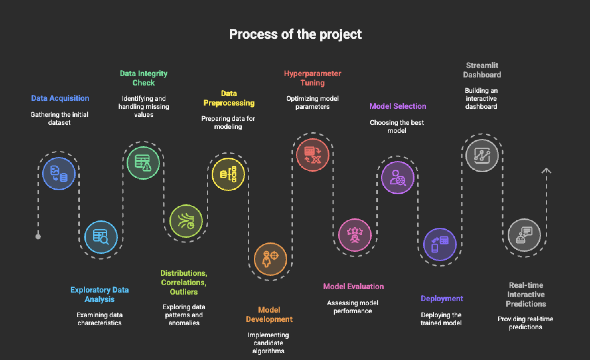

# Injection Moulding Defect Detection with Machine Learning

## Executive Summary

### Business Problem
Manufacturers of injection moulded plastic parts face frequent challenges in maintaining consistent product quality. Defective parts (classified as Waste or Inefficient) result in financial loss, wasted resources, and customer dissatisfaction. Traditional manual inspection is slow, inconsistent, and fails to provide early feedback during production.

### Proposed Solution
This project delivers a supervised machine learning system that predicts the quality of a part based on key process variables such as melt temperature, mould temperature, injection time, and cooling time. By integrating outlier detection, rigorous preprocessing, and cross-validated model training, the system identifies whether a product cycle will result in Waste, Acceptable, Target, or Inefficient quality.  

The best-performing model, **Random Forest**, achieves approximately **96% test accuracy** and near-perfect ROC-AUC, making it suitable for real-time decision support. A companion Streamlit dashboard provides an accessible interface for engineers and managers to test scenarios interactively.

### Next Steps
To extend the value of this system, several practical steps are recommended:

1. **Integration with Production Systems**  
   Connect the model to live machine sensors so predictions can be generated in real time.

2. **Scalability Testing**  
   Evaluate model performance on larger datasets and across multiple production lines to ensure generalizability.

3. **Cloud Deployment**  
   Deploy the Streamlit dashboard as a hosted web application with authentication for secure company-wide access.

4. **Continuous Learning**  
   Automate periodic retraining of the model with new production data to maintain accuracy over time.

5. **Explainability and Alerts**  
   Incorporate SHAP or feature attribution tools to provide transparency into predictions, and set up automatic alerts when defect probabilities exceed thresholds.

---

This project demonstrates that machine learning can provide fast, reliable classification of injection moulding quality. By adopting the outlined next steps, manufacturers can reduce defects, improve efficiency, and strengthen quality assurance processes.

## Dataset

- **Size**: 1,0000 records  
- **Features**: 13 process variables  
- **Target**: Product quality with four possible classes  
  - Waste  
  - Acceptable  
  - Target  
  - Inefficient  

### Key Points
- Variables include factors such as melt temperature, mould temperature, cycle time, injection pressure, and cooling time.  
- The dataset is balanced enough to allow training without heavy resampling.  
- It reflects real-world injection moulding conditions, making the results meaningful for manufacturing settings.

## Process of Project

The overall process is shown below:

## Business Recommendations

Based on the findings and results of this project, the following recommendations are made for manufacturers using injection moulding processes:

1. **Adopt predictive monitoring**  
   Integrate the Random Forest model into production lines to flag potential defects early and reduce wasted cycles.

2. **Automate quality checks**  
   Replace manual inspection with model-driven predictions to improve speed, consistency, and reduce labor costs.

3. **Optimize process settings**  
   Use the Streamlit dashboard for what-if analysis. Engineers can adjust process variables virtually to see the expected quality outcome before applying changes on the shop floor.

4. **Reduce operational costs**  
   Early detection of Waste and Inefficient products lowers raw material loss and energy consumption.

5. **Build continuous improvement loops**  
   Retrain the model regularly with new production data to adapt to changes in materials, machines, or environments.

---

### Next Steps
To extend the value of this system, several practical steps are recommended:

1. **Integration with Production Systems**  
   Connect the model to live machine sensors so predictions can be generated in real time.

2. **Scalability Testing**  
   Evaluate model performance on larger datasets and across multiple production lines to ensure generalizability.

3. **Cloud Deployment**  
   Deploy the Streamlit dashboard as a hosted web application with authentication for secure company-wide access.

4. **Continuous Learning**  
   Automate periodic retraining of the model with new production data to maintain accuracy over time.

5. **Explainability and Alerts**  
   Incorporate SHAP or feature attribution tools to provide transparency into predictions, and set up automatic alerts when defect probabilities exceed thresholds.

## Conclusion

This project demonstrates that machine learning can accurately predict injection moulding product quality. By following the recommendations above, manufacturers can increase efficiency, reduce costs, and improve customer satisfaction. The system is practical, scalable, and provides a foundation for broader adoption of AI in manufacturing.
